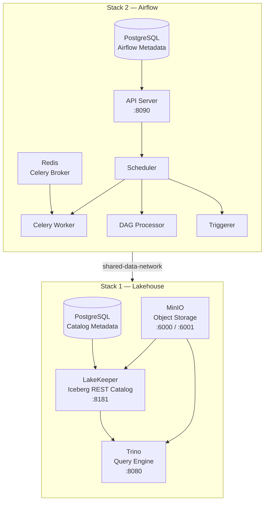

# Lakehouse Infrastructure

Two Docker Compose stacks that provision a complete open lakehouse platform -- from S3-compatible object storage to a distributed SQL query engine -- with fully automated bootstrap. No manual setup beyond `docker compose up`.

## Architecture



## Lakehouse Stack

Defined in `Lakehouse/docker-compose.yml`. Provides the core data platform services.

| Service | Image | Port | Role |
|---|---|---|---|
| MinIO | `minio/minio:latest` | 6000 (API) / 6001 (Console) | S3-compatible object storage for raw data and Iceberg data files |
| LakeKeeper | `lakekeeper/catalog:latest-main` | 8181 | Apache Iceberg REST catalog -- manages table metadata |
| Trino | `trinodb/trino:latest` | 8080 | Distributed SQL query engine over Iceberg tables |
| PostgreSQL | `postgres:17` | 5434 | Metadata store for LakeKeeper |

### Bootstrap Sequence

Three init containers run automatically on first startup, in order:

1. **`minio_create_default_bucket`** -- Creates the `warehouse` S3 bucket in MinIO using the MinIO CLI (`mc`).
2. **`lakekeeper-init`** (`init.py`) -- Bootstraps LakeKeeper: accepts the Terms of Service, creates the `lakehouse_warehouse` warehouse pointing to the MinIO bucket, and provisions three Iceberg namespaces: `staging`, `intermediate`, and `marts`. Each step is idempotent.
3. **Trino** starts once LakeKeeper and MinIO are healthy, configured via `iceberg.properties` to use LakeKeeper as its REST catalog and MinIO for S3 storage.

## Airflow Stack

Defined in `Airflow/docker-compose.yaml`. Provides workflow orchestration using the CeleryExecutor architecture.

| Service | Image | Port | Role |
|---|---|---|---|
| API Server | Custom (Airflow 3.1.6) | 8090 | Web UI and REST API |
| Scheduler | Custom (Airflow 3.1.6) | -- | Schedules and triggers DAG runs |
| DAG Processor | Custom (Airflow 3.1.6) | -- | Parses and validates DAG files |
| Celery Worker | Custom (Airflow 3.1.6) | -- | Executes tasks distributed via Redis |
| Triggerer | Custom (Airflow 3.1.6) | -- | Handles deferrable operators |
| Redis | `redis:7.2-bookworm` | 6379 | Celery message broker |
| PostgreSQL | `postgres:16` | -- | Airflow metadata database |

The custom Airflow image (`Dockerfile`) extends `apache/airflow:3.1.6` with `dbt-trino`, `astronomer-cosmos`, `pyiceberg`, `pydantic`, `s3fs`, and other pipeline dependencies.

DAGs are synced from Git via the `apache-airflow-providers-git` bundle, tracking the `main` branch with a 120-second refresh interval.

## Networking

Both stacks share a Docker bridge network named `shared-data-network`. The Lakehouse stack creates it; the Airflow stack joins it as an external network. This allows Airflow workers to reach MinIO, LakeKeeper, and Trino by container hostname.

## Getting Started

1. Add host entries (required for local development outside Docker):
   ```
   127.0.0.1 minio
   127.0.0.1 trino
   ```

2. Start the Lakehouse stack first (creates the shared network):
   ```bash
   docker compose up                  # from Lakehouse-Composes/Lakehouse/
   ```

3. Wait for all services to be healthy, then start the Airflow stack:
   ```bash
   docker compose up -d --build       # from Lakehouse-Composes/Airflow/
   ```

## Service Endpoints

| Service | URL |
|---|---|
| Airflow UI | [http://localhost:8090](http://localhost:8090) |
| MinIO Console | [http://localhost:6001](http://localhost:6001) |
| MinIO API | [http://localhost:6000](http://localhost:6000) |
| LakeKeeper | [http://localhost:8181](http://localhost:8181) |
| Trino | [http://localhost:8080](http://localhost:8080) |
