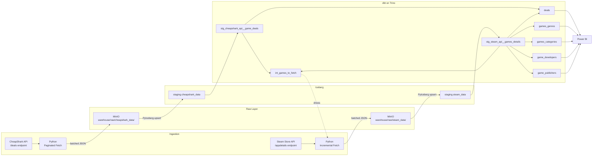

# ELT Pipelines & dbt Transformations

Application layer implementing a complete ELT pipeline: external APIs are ingested into raw JSON in object storage, upserted into Apache Iceberg tables via PyIceberg, and transformed through a three-layer dbt modelling architecture on Trino -- all orchestrated as Airflow DAGs with Astronomer Cosmos.

## End-to-End Data Flow



## Project Structure

```
Lakehouse-Dags/
  pipelines/
    common/
      __init__.py            # Re-exports upsert_iceberg_table, catalog, s3fs
      connections.py         # PyIceberg REST catalog + S3FileSystem singletons
      transform.py           # Generic upsert: JSON -> Pydantic -> PyArrow -> Iceberg
    cheapshark/
      DAG_cheapshark.py      # Airflow DAG definition
      ingestion.py           # Paginated API fetch + JSON writes to MinIO
      model.py               # Pydantic model: GameDeal
    steam/
      DAG_steam_api.py       # Airflow DAG definition
      ingestion.py           # Incremental API fetch + JSON writes to MinIO
      model.py               # Pydantic models: SteamGame + nested types
  dbt_project/
    dbt_project.yml          # Project config (materialization, schema mapping)
    profiles.yml             # Trino connection profile
    macros/                  # Custom schema macro (no prefix)
    models/
      staging/               # Views: clean + rename raw Iceberg tables
      intermediate/          # Operational logic (e.g., set-difference)
      marts/Game/            # Denormalized tables for BI consumption
```

## Data Sources

### CheapShark Pipeline

Fetches paginated game deal data from the CheapShark API (Steam store deals only).

**DAG: `get_cheapshark_deals`**

```
load_json_deals -> load_to_iceberg -> dbt_transform
```

1. **Ingestion** -- Iterates through API pages using a generator. Every 10 pages, the accumulated records are written as a JSON batch to `warehouse/raw/cheapshark_data/{YYYY/MM/DD}/deals_{n}.json` in MinIO. Includes 1.8s rate limiting between requests.
2. **Iceberg Upsert** -- Each JSON file is read, validated against the `GameDeal` Pydantic model, converted to a PyArrow table, and upserted into `staging.cheapshark_data` keyed on `(dealID, ingestionDate)`.
3. **dbt Transform** -- Cosmos runs `stg_cheapshark_api__game_deals` and its downstream models.

### Steam Pipeline

Incrementally enriches deal data with detailed game metadata from the Steam Store API.

**DAG: `get_games_metadata`**

```
dbt_create_missing_games -> get_missing_games -> load_to_iceberg -> dbt_transform
```

1. **Find Missing Games** -- A `DbtRunLocalOperator` materializes `int_games_to_fetch` as a table. This intermediate model computes the set difference: CheapShark `steam_app_id` values that have no corresponding row in the Steam details staging table. Only new, un-enriched games are selected.
2. **Ingestion** -- Python reads the `int_games_to_fetch` Iceberg table, then fetches metadata for each `steam_app_id` from the Steam Store API. Records are batched into JSON files (10 games per file) and written to MinIO. Non-critical failures (individual game fetch errors) are logged and skipped.
3. **Iceberg Upsert** -- JSON files are validated against the `SteamGame` Pydantic model (170 fields across 15+ nested types) and upserted into `staging.steam_data` keyed on `steam_appid`.
4. **dbt Transform** -- Cosmos runs `stg_steam_api__games_details` and its downstream mart models.

## dbt Transformation Layer

Three-layer architecture following dbt best practices, running on Trino against the Iceberg catalog:

### Staging (Views)

Clean and rename raw Iceberg tables. `camelCase` API fields become `snake_case` columns. Type casting (Unix timestamps to dates, IDs to VARCHAR). Columns are grouped by type with comment headers (`-- ids`, `-- strings`, `-- numeric`, `-- booleans`, `-- dates`, `-- arrays & structs`).

### Intermediate (Views / Tables)

Operational logic that supports pipeline mechanics. `int_games_to_fetch` is materialized as a table so Python can read it via PyIceberg -- it computes the set of CheapShark games not yet present in the Steam staging table, driving the incremental enrichment loop.

### Marts (Tables)

Denormalized, analytics-ready tables consumed by Power BI:

| Model | Description |
|---|---|
| `deals` | CheapShark deals joined with Steam game metadata (pricing, ratings, platform support, release dates) |
| `games_genres` | Flattened game-to-genre relationships via `CROSS JOIN UNNEST` |
| `games_categories` | Flattened game-to-category relationships (e.g., multiplayer, achievements) |
| `game_developers` | Flattened game-to-developer relationships |
| `game_publishers` | Flattened game-to-publisher relationships |

Astronomer Cosmos runs dbt models as native Airflow tasks, with `DbtTaskGroup` for multi-model execution and `DbtRunLocalOperator` for targeted single-model runs. Profile configuration uses `TrinoBaseProfileMapping` connecting to the `iceberg` catalog.

## Key Design Decisions

- **Open Table Format** -- Apache Iceberg provides ACID transactions, schema evolution, and time travel over data stored as Parquet files in MinIO. LakeKeeper serves as the REST catalog, decoupling metadata management from the query engine.
- **Generic Upsert Function** -- A single `upsert_iceberg_table()` function handles any data source: it accepts a Pydantic model class, auto-derives the PyArrow schema via `pydantic_to_pyarrow`, and upserts into Iceberg with configurable primary keys.
- **Pydantic Validation at the Boundary** -- All API responses are validated through Pydantic models before touching Iceberg, catching schema drift and malformed records at ingestion time.
- **Incremental Enrichment** -- The Steam pipeline only fetches metadata for games that don't already exist in the staging table, using a SQL set difference computed by dbt. This avoids redundant API calls and respects rate limits.
- **Rate Limiting** -- 1.8-second delays between API calls with proper handling for HTTP 429 responses (log and re-raise).
- **Cosmos Integration** -- dbt models run as native Airflow tasks via Astronomer Cosmos, providing task-level visibility, retries, and dependency management within the Airflow UI.
