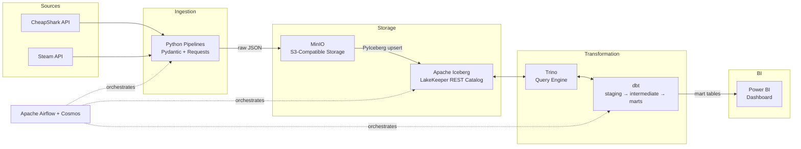

# LakeHouse Project

End-to-end ELT pipeline built on an open lakehouse architecture. Game deal data is ingested from external APIs, landed as raw JSON in S3-compatible object storage, upserted into Apache Iceberg tables, transformed through a dbt modelling layer on Trino, and served to a Power BI dashboard -- all orchestrated by Apache Airflow.

## Architecture



## Tech Stack

| Layer | Technology |
|---|---|
| Orchestration | Apache Airflow 3.1.6 + Astronomer Cosmos |
| Object Storage | MinIO (S3-compatible) |
| Table Format | Apache Iceberg |
| Iceberg Catalog | LakeKeeper (REST) |
| Query Engine | Trino |
| Transformations | dbt-trino |
| Data Validation | Pydantic |
| BI | Power BI |
| Infrastructure | Docker Compose |

## ELT Pipelines

**CheapShark Deals** -- Paginates through the CheapShark API, writes batched JSON files to MinIO, validates records with Pydantic, and upserts them into an Iceberg staging table. dbt then cleans, renames, and joins the data into analytics-ready mart tables.

**Steam Game Metadata** -- An incremental enrichment pipeline. A dbt intermediate model computes the set difference between CheapShark game IDs and already-fetched Steam metadata, producing a list of games still missing. Python fetches only those games from the Steam Store API, upserts them into Iceberg, and dbt builds marts that unnest genres, categories, developers, and publishers into normalized tables.

Both pipelines are fully orchestrated as Airflow DAGs with Cosmos running dbt models as native Airflow tasks.

## Project Structure

```
├── Lakehouse-Composes/    # Docker infrastructure (Lakehouse + Airflow stacks)
├── Lakehouse-Dags/        # Airflow DAGs, Python pipelines, dbt project
└── Lakehouse-Dashboard/   # Power BI dashboard
```

See each subfolder's README for detailed documentation.

## Getting Started

1. Add host entries for local development:
   ```
   127.0.0.1 minio
   127.0.0.1 trino
   ```
2. Start the Lakehouse stack (must start first):
   ```bash
   docker compose up                  # from Lakehouse-Composes/Lakehouse/
   ```
3. Start the Airflow stack:
   ```bash
   docker compose up -d --build       # from Lakehouse-Composes/Airflow/
   ```
4. Open the Airflow UI at [http://localhost:8090](http://localhost:8090) and trigger the DAGs.
